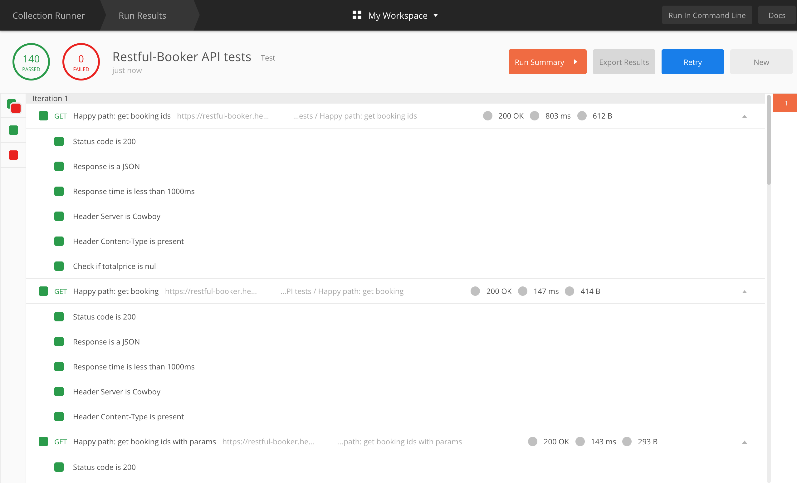

# Restul-Booker API tests

This repository contains API tests for https://restful-booker.herokuapp.com - an API playground which allows to perform all CRUD methods. The tests were created and performed in Postman and then exported to JSON files.

## Test scenario categories

The test activities have been divided into categories:

* Happy path: basic positive tests for a standard CRUD process

    1. GET get booking ids
    2. GET get booking
    3. GET get booking ids with params
    4. POST create booking
    5. GET get created booking
    6. (POST create token)
    7. PUT update booking
    8. GET get updated booking
    9. (POST create token)
    10. PATCH partial update booking
    11. GET get updated booking
    12. (POST create token)
    13. DELETE delete booking

* Negative tests with valid input

    14. (POST create token)
    15. DELETE delete booking that doesn’t exist
    16. GET get booking which doesn't exist
    17. DELETE delete booking without permission

* Negative tests with invalid input

    18. POST create booking with missing parameters
    19. POST create booking with invalid parameters - wrong firstname
    20. POST create booking with invalid parameters - wrong totalprice
    21. GET get booking with invalid parameters - wrong totalprice
    22. POST create booking with invalid parameters - wrong depositpaid
    23. GET get booking with invalid parameters - wrong depositpaid
    24. POST create booking with invalid parameters - wrong bookingdates
    25. POST create booking with invalid model
    26. PUT update booking with invalid authorisation token

* Destructive tests

    27. POST create booking with param longer than 200 characters
    28. POST empty payloads

* Other

    29. OPTIONS get options
    30. HEAD get booking ids without body

## Test actions

For every response a test suite has been performed, for example:

* For response status, json and time:
    - Status code is 200
    - Response is a JSON
    - Response time is less than 1000ms
* For response headers:
    - Header Server is Cowboy
    - Header Content-Type is present
* For response body:
    - Check if totalprice is null
    - Check if lastname is McDrive
    - Body is correct

## Test results
All tests are passed.

