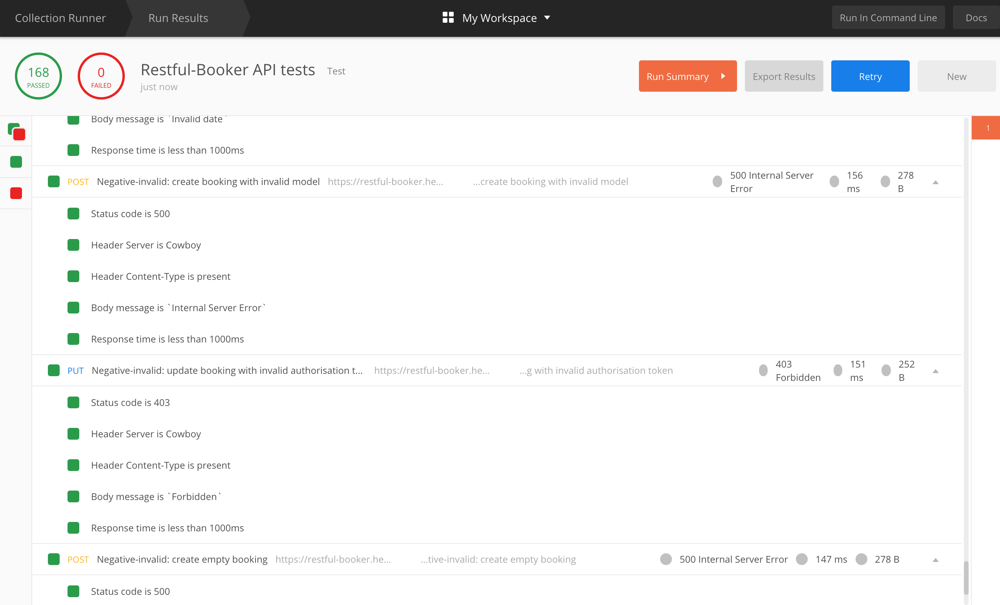

# Restul-Booker API tests

This repository contains API tests for https://restful-booker.herokuapp.com - an API playground which allows to perform all CRUD methods. The tests were created and performed in Postman and then exported to JSON files.

## Test scenario categories

The test activities have been divided into categories:

* Happy path: basic positive tests for a standard CRUD process

    1. GET get booking ids
    2. GET get booking
    3. GET get booking ids with params
    4. POST create booking
    5. GET get created booking
    6. (POST create authentication token)
    7. PUT update booking
    8. GET get updated booking
    9. (POST create authentication token)
    10. PATCH partial update booking
    11. GET get updated booking
    12. (POST create authentication token)
    13. DELETE delete booking
    14. POST create booking with param longer than 200 characters
    15. OPTIONS get options
    16. HEAD get booking ids without body

* Negative tests with valid input

    17. (POST create authentication token)
    18. DELETE delete booking that doesn’t exist
    19. GET get booking which doesn't exist
    20. DELETE delete booking without permission

* Negative tests with invalid input

    21. POST create booking with missing parameters
    22. POST create booking with invalid parameters - wrong firstname
    23. POST create booking with invalid parameters - wrong totalprice
    24. GET get booking with invalid parameters - wrong totalprice
    25. POST create booking with invalid parameters - wrong depositpaid
    26. GET get booking with invalid parameters - wrong depositpaid
    27. POST create booking with invalid parameters - wrong bookingdates
    28. POST create booking with invalid model
    29. PUT update booking with invalid authorisation token
    30. POST create empty booking

## Test actions

For every response a test suite has been performed, for example:

* For response status:
    - Status code is 200
* For response headers:
    - Header Server is Cowboy
    - Header Content-Type is present
* For response body:
    - Response is a JSON
    - Response schema is correct
    - JSON values are correct types
    - Check if totalprice is null
    - Check if lastname is McDrive
    - Body is correct
* For performance:
    - Response time is less than 1000ms

## Test results
All tests are passed.

